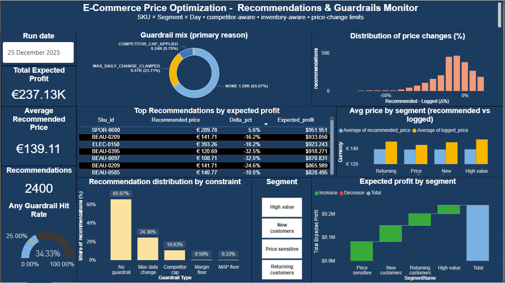

# Dynamic Pricing for Mid-Size E-Commerce (SKU × Segment × Day)

## Overview
This project builds an end-to-end dynamic pricing system for a mid-size e-commerce retailer:
- Scale: 600 SKUs × 4 customer segments × daily decisions
- Objective: maximize expected profit with business guardrails
- Output: daily recommended prices + reason codes + monitoring dashboard

## Dashboard preview


## Business objective
Maximize expected profit per SKU-segment-day:  
(price - unit_cost) × E[units]

## Guardrails (pricing rules)
- Margin floor: enforce minimum margin over cost  
- Price change limit: clamp day-over-day change (e.g., ±10%)  
- Competitor cap (KVI items): avoid exceeding competitor beyond threshold  
- MAP/MSRP handling: respect MAP when present; apply ceiling where required  
- Promo behavior: promo rows can lock/override standard pricing rules  

Each recommendation logs reason codes (e.g., `MAX_DAILY_CHANGE_CLAMPED`, `COMPETITOR_CAP_APPLIED`) for auditability.

## Data + pipeline
Synthetic e-commerce dataset generated into SQLite:
- Dimensions: SKUs, customer segments, calendar
- Facts: traffic, prices shown, sales, inventory
- Feature table grain: SKU × Segment × Day

## Modeling
A supervised model predicts expected units given context + price features.  
The pricing engine evaluates candidate prices, applies guardrails, and outputs a final recommendation.

## Outputs
- SQLite DB: `data/pricing.db`  
- Daily recommendations table: `pricing_recommendations`  
- Run summary table: `pricing_run_summary`  
- Dashboard exports: `dashboards/exports/`  
- Screenshots: `docs/screenshots/`  

## Dashboard
Power BI dashboard monitors:
- expected profit and pricing level
- distribution of price changes (Δ%)
- guardrail mix + guardrail pressure
- top recommendations by expected profit

Screenshots:
- `docs/screenshots/dashboard_page1.png`

## How to run (repro)
From project root:

```bat
python src\db_init.py
python src\db_seed.py
python src\generate_dim_sku.py
python src\generate_fact_inventory.py
python src\generate_fact_traffic.py
python src\generate_fact_prices_shown.py
python src\generate_fact_sales.py
python src\validate_data.py
python src\build_features.py
python src\validate_features.py
python src\train_units_model.py
python -m src.run_pricing_job
python -m src.build_run_summary
